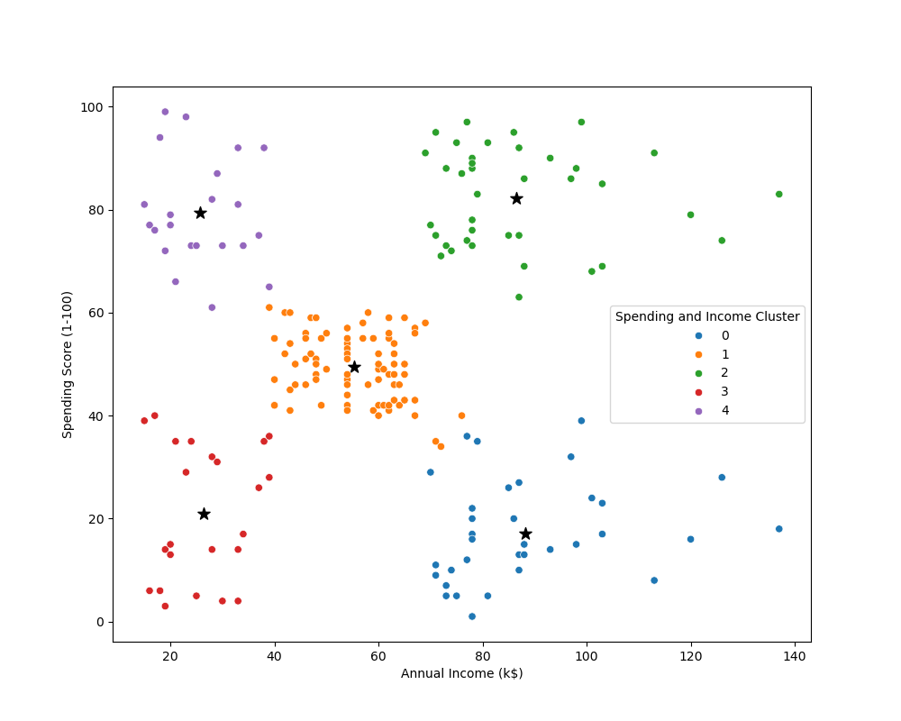

# Mall Customer Analysis

## Objective
**Understanding Customer Behavior**: This project aims to analyze customer data to uncover distinct customer groups and their shopping patterns. By segmenting customers, mall management can:

- Identify key customer segments based on demographic and behavioral data.
- Develop targeted marketing strategies and improve customer satisfaction.

## Analysis

- Target Group would be cluster 2 with high spending score and high income.
- 54% of cluster 2 shoppers are females
- Cluster 4 presents an interesting opportunity to market to the customers for sale event on popular items.
